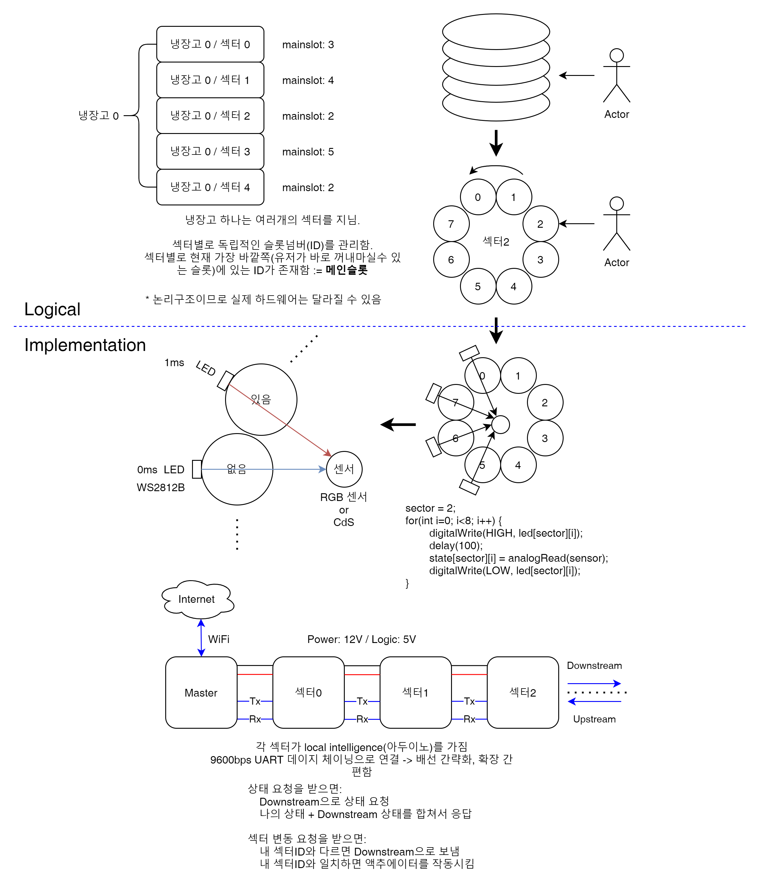

# MR-DORR
 MR 2021 Project DORR - Drink-Oriented Remote Refrigerator

## 개요

### Terminology
* 냉장고 아이디(RID): 냉장고별로 가지는 고유의 ID
* 섹터주소(SID): 냉장고의 각 섹터는 랜덤한 32비트 고유주소를 가짐(ex. 3A:BE:E3:E3)
  * 단일 냉장고에서 이 값이 겹치지 않는다고 가정할 수 있음

## 서버

### Authentication

* *x-api-key* 헤더에 배포된 api key를 담아서 전송
---
### Client Side Endpoints

#### GET /stat
응답 예시
```json
{
    "test1234": "Test Refrigerator.",
    "test4321": "Test Refrigerator2."
}
```
* 사용 가능한 모든 냉장고를 리스팅
* 키: RID, 값: Alias

#### POST /stat/\<RID>
요청 예시 (POST /stat/test4321)
```json
{
  "name": "Test Refrigerator2."
}
```
* RID에 해당하는 냉장고 객체를 생성
* 만약 이미 있다면, Alias만 변경됨

#### GET /stat/\<RID>
응답 예시 (GET /stat/test1234)
```json
{
    "initialized": true,
    "lastUpdated": 1629556143961439500,
    "name": "Test Refrigerator.",
    "opened": false,
    "status": {
        "3ABEE3E3": {
            "mainslot": 2,
            "numslot": 4,
            "status": [
                null,
                "asdf",
                "fdsa",
                null
            ]
        },
        "BF3A4C21": {
            "mainslot": 4,
            "numslot": 6,
            "status": [
                null,
                "asdf",
                "fdsa",
                null,
                "qwer",
                null
            ]
        }
    }
}
```
응답 예시 (GET /stat/test4321)
```json
{
    "initialized": false,
    "name": "Test Refrigerator2."
}
```
* RID에 해당하는 냉장고의 현재 상태
* 만약 객체가 한번도 하트비트를 받지 못했다면, initialized 속성이 false이며 name이외의 속성을 사용할 수 없음
* lastUpdated: 마지막으로 하트비트를 받은 시점의 Unix Epoch(nano second)
* opened: 냉장고 문이 열려있으면 true, 아니면 false
  * 냉장고는 냉장고 문의 상태가 변경되면 즉시 보고하여 상태를 업데이트할 의무를 가짐
  
#### DELETE /stat/\<RID>
냉장고 객체를 삭제

#### PUT /stat/\<RID>
요청 예시 (PUT /stat/test1234)
```json
{
  "status":{
    "BF3A4C21": 3
  }
}
```
* RID에 해당하는 냉장고의 특정 섹터(들)의 메인슬롯 변경을 요청함
---
### Refrigerator Side Endpoints

#### POST /refrig/\<RID>
요청 예시 (POST /refrig/test1234)
```json
{
  "opened": false,
  "status": {
    "3ABEE3E3": {
        "numslot": 4,
        "mainslot": 2,
        "status": [
            null,
            "asdf",
            "fdsa",
            null
        ]
    },
    "BF3A4C21": {
        "numslot": 6,
        "mainslot": 4,
        "status": [
            null,
            "asdf",
            "fdsa",
            null,
            "qwer",
            null
        ]
    }
  }
}
```
응답 예시
```json
{
    "urgent": false,
    "status": {
        "BF3A4C21": 3
    }
}
```
* 현재 냉장고의 상태를 서버에 보고(10초에 한번? 30초에 한번?)
* status 객체는 메인슬롯 변경 요청(들)을 담음
* urgent 속성이 true일 경우, 가능한 한 빠르게(best-effort) 다음 하트비트 요청을 전송함.
* opened: 냉장고 문이 열려있으면 true, 아니면 false
  * 냉장고는 냉장고 문의 상태가 변경되면 즉시 보고하여 상태를 업데이트할 의무를 가짐

---

### Errors
* 200: 요청이 올바르게 처리/전달 되었음
* 400: 올바르지 않은 요청(Invalid JSON, etc...)
* 401: x-api-key 헤더가 없음
* 403: x-api-key 헤더의 값이 잘못됨
* 404: RID에 해당하는 냉장고가 없음
  * PUT /stat/\<RID>: 평문 응답에 따라 의미가 다름
    * Uninitialized RID: 해당 냉장고가 아직 초기화되지 않았음(하트비트를 받지 못함)
    * 그 외: RID에 해당하는 냉장고가 없음

* 405: Method not allowed
* 500: Internal Server Error